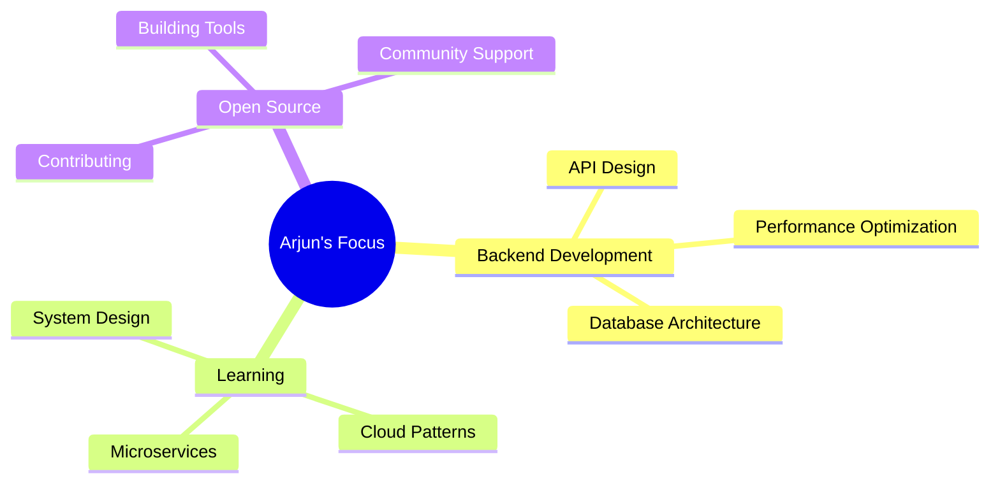

# <div align="center">👋 Hi there, I'm Arjun Adhikari</div>

<div align="center">
  
[](https://git.io/typing-svg)

</div>

<div align="center">
  

[](https://www.linkedin.com/in/thearjun)
[](https://twitter.com/iArjunAdhikari)
[](https://adhikariarjun.com.np)

</div>

---

## 🚀 About Me

```python
class ArjunAdhikari:
    def __init__(self):
        self.name = "Arjun Adhikari"
        self.role = "Backend Engineer"
        self.location = "Pokhara, Nepal 🏔️"
        self.company = "wesionaryTEAM"
        self.languages = ["Python", "Rust", "TypeScript"]
        self.focus = ["Scalable Applications", "API Development", "Performance Optimization"]
        self.currently_learning = ["System Design", "Generative AI"]
    
    def say_hi(self):
        print("Thanks for dropping by! Let's build something amazing together 🚀")

me = ArjunAdhikari()
me.say_hi()
```

---

## 📊 GitHub Activity

<div align="center">
  
[](https://git.io/streak-stats)

</div>

---

## 📈 Activity Graph

<div align="center">
  
[](https://github.com/ashutosh00710/github-readme-activity-graph)

</div>

---

## 🎯 Current Focus

<div align="center">



</div>

---

## 🌟 Fun Facts

- 🏔️ Living in the beautiful city of Pokhara, surrounded by the Himalayas
- 🚀 Love optimizing code performance and building scalable systems
- 🌱 Always learning new technologies and best practices
- 💡 Enjoy solving complex problems with elegant solutions
- 🤝 Open to collaborating on interesting projects

---

## 📫 Let's Connect!

<div align="center">

I'm always excited to connect with fellow developers and discuss new ideas, projects, or opportunities!

[](https://www.linkedin.com/in/thearjun)
[](https://twitter.com/iArjunAdhikari)
[](https://adhikariarjun.com.np)
[](mailto:your-email@example.com)

</div>

<div align="center">
  
**✨ Thanks for visiting my profile! Have a great day! ✨**

</div>
