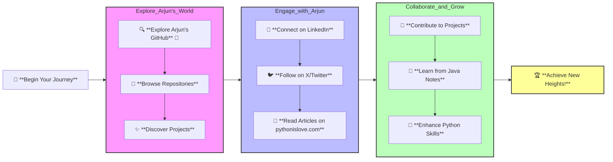

# Hi there, I'm Arjun Adhikari 👋

I'm a Backend Engineer specializing in Python and Rust, passionate about building efficient and scalable applications.

- 🌍 I'm based in Pokhara, Nepal
- 🏢 Currently working at [wesionaryTEAM](https://wesionary.team/)
- 🌐 Personal website: [adhikariarjun.com.np](https://adhikariarjun.com.np)
- 📝 I write articles on [pythonislove.com](https://pythonislove.com)
- 💼 Connect with me on [LinkedIn](https://www.linkedin.com/in/thearjun)
- 🐦 Follow me on [X/Twitter](https://twitter.com/iArjunAdhikari)

## 🛠️ Technologies & Tools

Feel free to explore these repositories and contribute!

## 📫 Get in Touch

I'm always open to discussing new projects, creative ideas, or opportunities to be part of your visions. Reach out to me through [LinkedIn](https://www.linkedin.com/in/thearjun) or [X/Twitter](https://twitter.com/iArjunAdhikari).

```mermaid
flowchart LR
    %% Define subgraphs for clarity
    subgraph Explore_Arjun's_World
        direction TB
        A[🔍 **Explore Arjun's GitHub** 🚀] --> B[📂 **Browse Repositories**]
        B --> C[✨ **Discover Projects**]
    end

    subgraph Engage_with_Arjun
        direction TB
        D[💼 **Connect on LinkedIn**] --> E[🐦 **Follow on X/Twitter**]
        E --> F[📖 **Read Articles on pythonislove.com**]
    end

    subgraph Collaborate_and_Grow
        direction TB
        G[🤝 **Contribute to Projects**] --> H[📘 **Learn from Java Notes**]
        H --> I[🐍 **Enhance Python Skills**]
    end

    %% Main flow
    Start[🌟 **Begin Your Journey**] --> Explore_Arjun's_World
    Explore_Arjun's_World --> Engage_with_Arjun
    Engage_with_Arjun --> Collaborate_and_Grow
    Collaborate_and_Grow --> Success[🏆 **Achieve New Heights!**]

    %% Clickable links
    click A "https://github.com/thearjun" "Arjun's GitHub Profile"
    click D "https://www.linkedin.com/in/thearjun" "Arjun's LinkedIn"
    click E "https://twitter.com/iArjunAdhikari" "Arjun's X/Twitter"
    click F "https://pythonislove.com" "Python Is Love Articles"
    click H "https://github.com/thearjun/java-notes" "Java Notes Repository"

    %% Styling
    style Explore_Arjun's_World fill:#f9f,stroke:#333,stroke-width:2px
    style Engage_with_Arjun fill:#bbf,stroke:#333,stroke-width:2px
    style Collaborate_and_Grow fill:#bfb,stroke:#333,stroke-width:2px
    style Success fill:#ff9,stroke:#333,stroke-width:2px

```
